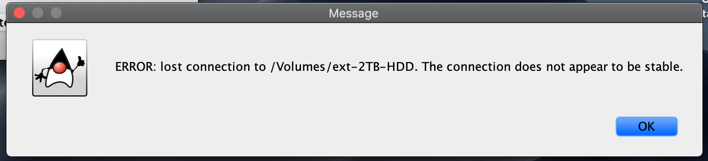

# Stable Disk Connection Checker

A Java application that verifies if the connection to an internal or
external drive (HDD, SSD, USB, etc.) is very stable or not.
  

---  
There are numerous disk health check programs available for free that are quite
good at detecting the health of storage devices, but unfortunately they do not
account for bad connections. For example: you can have a HDD that is in
perfect condition, but randomly disconnects periodically due to a bad SATA
cable, USB cable, or just because the cable needs reseated.

If your storage medium passes disk health checks, but programs running off of it
seem to be crashing but not when ran off of your primary storage device, this
program may help identify if you have a bad connection.

In the case that you do, it's recommended that you first try reseating any
connections (unplugging and plugging back in again), and if that doesn't work,
replacing any cables involved or trying a different port.
## Usage
This program requires Java (it was built using OpenJDK Runtime Environment
build 13.0.1+9, but likely will work on Oracle and earlier versions of Java).

Once installed, you just have to run the `.java` file and follow the on-screen
instructions.

  

If the drive passes the test, it will display

Otherwise, it'll display

